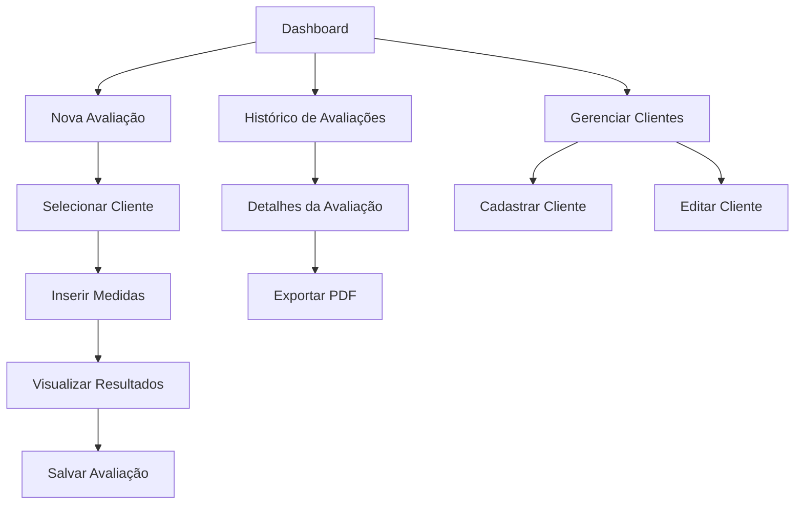

## 1. Product Overview
Sistema de avaliação física profissional que calcula composição corporal através de medidas de perimetria e 7 dobras cutâneas. Calcula percentual de gordura, massa magra, taxa metabólica basal (BMR) e gasto energético total (TDEE).

O produto visa profissionais de educação física e nutrição que precisam de avaliações precisas e rápidas para acompanhamento de clientes, permitindo histórico evolutivo e análises detalhadas do progresso corporal.

## 2. Core Features

### 2.1 User Roles
| Role | Registration Method | Core Permissions |
|------|---------------------|------------------|
| Profissional | Email registration | Criar avaliações, visualizar histórico, gerar relatórios |
| Cliente | Convite do profissional | Visualizar próprias avaliações, acompanhar progresso |
| Admin | Sistema | Gerenciar usuários, configurações do sistema |

### 2.2 Feature Module
Nosso sistema de avaliação física consiste nas seguintes páginas principais:
1. **Dashboard**: visão geral das avaliações recentes, estatísticas rápidas e acesso rápido às funções.
2. **Nova Avaliação**: formulário para inserir medidas de perimetria e 7 dobras, com cálculos automáticos.
3. **Histórico de Avaliações**: lista de todas as avaliações com filtros por cliente e datas.
4. **Detalhes da Avaliação**: visualização completa com todos os cálculos, gráficos de evolução e comparações.
5. **Gerenciar Clientes**: cadastro e edição de informações dos clientes.

### 2.3 Page Details
| Page Name | Module Name | Feature description |
|-----------|-------------|---------------------|
| Dashboard | Estatísticas rápidas | Exibir total de clientes, avaliações do mês, média de progresso. |
| Dashboard | Cards de acesso rápido | Botões para nova avaliação, buscar cliente, ver relatórios. |
| Dashboard | Lista recente | Mostrar últimas 5 avaliações realizadas com link para detalhes. |
| Nova Avaliação | Seleção de cliente | Buscar e selecionar cliente existente ou cadastrar novo. |
| Nova Avaliação | Dados antropométricos | Inserir peso, altura, idade, sexo do cliente. |
| Nova Avaliação | Perimetria | Medidas de braço, antebraço, tórax, cintura, quadril, coxa, panturrilha. |
| Nova Avaliação | 7 Dobras cutâneas | Medidas de tríceps, subescapular, peitoral, axilar média, suprailíaca, abdominal, coxa. |
| Nova Avaliação | Cálculos automáticos | Calcular BF%, massa magra, BMR e TDEE automaticamente ao salvar. |
| Nova Avaliação | Salvar avaliação | Armazenar todos dados na tabela de avaliações com timestamp. |
| Histórico de Avaliações | Filtros | Filtrar por cliente, período de datas, tipo de avaliação. |
| Histórico de Avaliações | Lista de avaliações | Exibir data, cliente, BF%, peso com ordenação por data. |
| Histórico de Avaliações | Ações | Link para detalhes, opção de excluir (com confirmação). |
| Detalhes da Avaliação | Informações gerais | Exibir dados do cliente, data da avaliação, observações. |
| Detalhes da Avaliação | Resultados calculados | Mostrar BF%, massa magra, massa gorda, BMR, TDEE com interpretação. |
| Detalhes da Avaliação | Gráfico de evolução | Gráfico de linha mostrando evolução do BF% e peso ao longo do tempo. |
| Detalhes da Avaliação | Tabela comparativa | Comparar valores atuais com avaliação anterior. |
| Detalhes da Avaliação | Exportar PDF | Gerar relatório em PDF com todos os dados e gráficos. |
| Gerenciar Clientes | Lista de clientes | Exibir todos clientes com busca e paginação. |
| Gerenciar Clientes | Cadastrar cliente | Formulário com nome, email, telefone, data nascimento, sexo. |
| Gerenciar Clientes | Editar cliente | Modificar informações cadastrais do cliente. |

## 3. Core Process

### Fluxo do Profissional
O profissional acessa o dashboard e pode iniciar uma nova avaliação. Seleciona o cliente (ou cadastra um novo), insere as medidas de perimetria e as 7 dobras cutâneas. O sistema calcula automaticamente o percentual de gordura usando a equação apropriada (sexo e idade), determina a massa magra, calcula o BMR pela equação de Harris-Benedict ajustada e estima o TDEE baseado no nível de atividade. Após salvar, pode visualizar os resultados completos, acompanhar a evolução através de gráficos e exportar relatórios em PDF.

### Fluxo do Cliente
O cliente acessa o sistema através do convite do profissional e pode visualizar apenas suas próprias avaliações, acompanhar o progresso através de gráficos e comparar resultados entre avaliações.

## 4. User Interface Design

### 4.1 Design Style
- **Cores primárias**: Azul profissional (#2563EB) e branco
- **Cores secundárias**: Verde para sucesso (#10B981), vermelho para alertas (#EF4444)
- **Estilo de botões**: Arredondados com sombra suave, hover effects
- **Fonte**: Inter para títulos, Roboto para texto corrido
- **Tamanhos de fonte**: Títulos 24-32px, texto 14-16px, labels 12-14px
- **Layout**: Card-based com grid responsivo, navegação lateral
- **Ícones**: Feather Icons ou Heroicons em estilo outline

### 4.2 Page Design Overview
| Page Name | Module Name | UI Elements |
|-----------|-------------|-------------|
| Dashboard | Cards estatísticos | Cards com números grandes, ícones coloridos, badges de tendência |
| Dashboard | Grid de acesso | Botões grandes com ícones e descrições, layout 2x2 |
| Nova Avaliação | Formulário dividido | Abas ou steps: Dados básicos → Perimetria → Dobras → Resultados |
| Nova Avaliação | Campos de medidas | Inputs numéricos com step 0.1mm, validação em tempo real |
| Histórico | Tabela | Tabela zebra com hover, ordenação clicável, paginação |
| Detalhes | Cards de resultados | Cards destacados com cores por categoria, badges de status |
| Detalhes | Gráficos | Chart.js com linhas suaves, tooltips detalhados, legenda clara |

### 4.3 Responsiveness
Desktop-first com adaptação mobile. Em dispositivos móveis, navegação lateral vira menu hambúrguer, formulários em coluna única, gráficos empilhados verticalmente. Touch-optimized com botões maiores e espaçamento adequado.