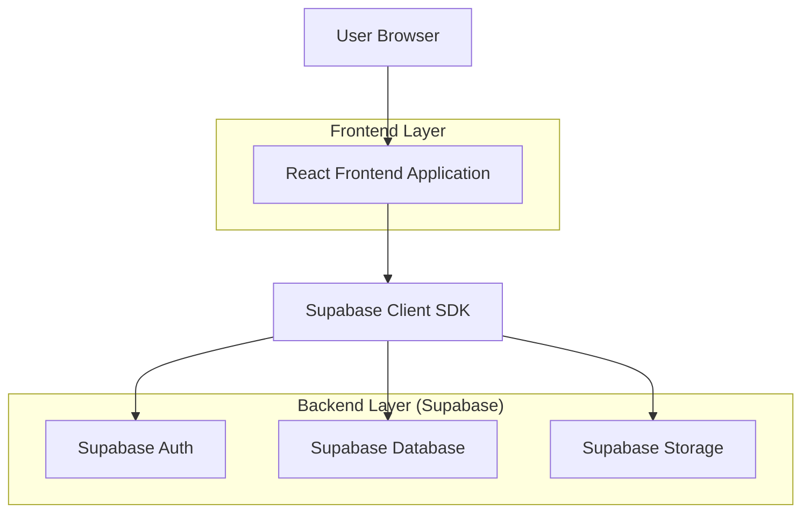
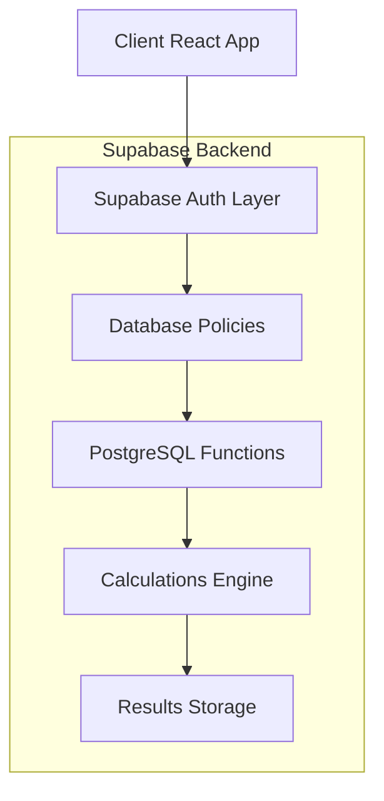

## 1. Architecture design



## 2. Technology Description

- **Frontend**: React@18 + tailwindcss@3 + vite
- **Initialization Tool**: vite-init
- **Backend**: Supabase (BaaS)
- **Database**: PostgreSQL (via Supabase)
- **Authentication**: Supabase Auth
- **Storage**: Supabase Storage (para relatórios PDF)
- **Charts**: Chart.js para visualizações
- **PDF Generation**: jsPDF + html2canvas

## 3. Route definitions

| Route | Purpose |
|-------|---------|
| / | Dashboard principal com estatísticas |
| /login | Página de autenticação do profissional |
| /avaliacao/nova | Formulário para nova avaliação física |
| /avaliacao/historico | Lista de avaliações com filtros |
| /avaliacao/:id | Detalhes completos de uma avaliação |
| /clientes | Gerenciamento de clientes |
| /clientes/novo | Cadastro de novo cliente |
| /clientes/:id/editar | Edição de cliente existente |
| /perfil | Configurações do profissional |

## 4. API definitions

### 4.1 Core API (Supabase Functions)

**Autenticação de Profissional**
```javascript
// Login via Supabase Auth
const { data, error } = await supabase.auth.signInWithPassword({
  email: professional@email.com,
  password: 'password'
})
```

**Criar Nova Avaliação**
```javascript
POST /api/avaliacoes

Request Body:
{
  cliente_id: string,
  data_avaliacao: Date,
  peso: number, // kg
  altura: number, // cm
  idade: number,
  sexo: 'M' | 'F',
  // Perimetria
  braco: number, // cm
  antebraco: number, // cm
  torax: number, // cm
  cintura: number, // cm
  quadril: number, // cm
  coxa: number, // cm
  panturrilha: number, // cm
  // 7 Dobras (mm)
  triceps: number,
  subescapular: number,
  peitoral: number,
  axilar_media: number,
  suprailiaca: number,
  abdominal: number,
  coxa_dobra: number,
  // Nível de atividade (para TDEE)
  nivel_atividade: 'sedentario' | 'leve' | 'moderado' | 'ativo' | 'muito_ativo'
}

Response:
{
  id: string,
  bf_percentual: number,
  massa_magra: number, // kg
  massa_gorda: number, // kg
  bmr: number, // kcal/dia
  tdee: number, // kcal/dia
  classificacao_bf: string,
  created_at: Date
}
```

**Buscar Avaliações por Cliente**
```javascript
GET /api/avaliacoes?cliente_id={id}

Response:
{
  avaliacoes: [{
    id: string,
    data_avaliacao: Date,
    peso: number,
    bf_percentual: number,
    massa_magra: number,
    bmr: number,
    // ... outros campos
  }]
}
```

## 5. Server architecture diagram



## 6. Data model

### 6.1 Data model definition

```mermaid
erDiagram
    PROFESSIONAL ||--o{ CLIENTE : gerencia
    CLIENTE ||--o{ AVALIACAO_FISICA : possui
    AVALIACAO_FISICA {
        uuid id PK
        uuid cliente_id FK
        date data_avaliacao
        decimal peso
        decimal altura
        integer idade
        char sexo
        // Perimetria
        decimal braco
        decimal antebraco
        decimal torax
        decimal cintura
        decimal quadril
        decimal coxa
        decimal panturrilha
        // Dobras (mm)
        decimal triceps
        decimal subescapular
        decimal peitoral
        decimal axilar_media
        decimal suprailiaca
        decimal abdominal
        decimal coxa_dobra
        // Resultados calculados
        decimal bf_percentual
        decimal massa_magra
        decimal massa_gorda
        decimal bmr
        decimal tdee
        string nivel_atividade
        text observacoes
        timestamp created_at
    }
    CLIENTE {
        uuid id PK
        uuid profissional_id FK
        string nome
        string email
        string telefone
        date data_nascimento
        char sexo
        timestamp created_at
    }
    PROFESSIONAL {
        uuid id PK
        string nome
        string email
        string cref
        timestamp created_at
    }
```

### 6.2 Data Definition Language

**Tabela de Profissionais**
```sql
-- create table
CREATE TABLE professionals (
    id UUID PRIMARY KEY DEFAULT gen_random_uuid(),
    email VARCHAR(255) UNIQUE NOT NULL,
    nome VARCHAR(100) NOT NULL,
    cref VARCHAR(20),
    created_at TIMESTAMP WITH TIME ZONE DEFAULT NOW()
);

-- grant permissions
GRANT SELECT ON professionals TO anon;
GRANT ALL ON professionals TO authenticated;
```

**Tabela de Clientes**
```sql
-- create table
CREATE TABLE clientes (
    id UUID PRIMARY KEY DEFAULT gen_random_uuid(),
    profissional_id UUID NOT NULL REFERENCES professionals(id),
    nome VARCHAR(100) NOT NULL,
    email VARCHAR(255),
    telefone VARCHAR(20),
    data_nascimento DATE,
    sexo CHAR(1) CHECK (sexo IN ('M', 'F')),
    created_at TIMESTAMP WITH TIME ZONE DEFAULT NOW(),
    updated_at TIMESTAMP WITH TIME ZONE DEFAULT NOW()
);

-- create indexes
CREATE INDEX idx_clientes_profissional_id ON clientes(profissional_id);
CREATE INDEX idx_clientes_nome ON clientes(nome);

-- grant permissions
GRANT SELECT ON clientes TO anon;
GRANT ALL ON clientes TO authenticated;

-- RLS policies
ALTER TABLE clientes ENABLE ROW LEVEL SECURITY;

CREATE POLICY "Profissionais podem ver seus clientes" ON clientes
    FOR SELECT USING (auth.uid() = profissional_id);

CREATE POLICY "Profissionais podem criar clientes" ON clientes
    FOR INSERT WITH CHECK (auth.uid() = profissional_id);

CREATE POLICY "Profissionais podem atualizar seus clientes" ON clientes
    FOR UPDATE USING (auth.uid() = profissional_id);
```

**Tabela de Avaliações Físicas**
```sql
-- create table
CREATE TABLE avaliacoes_fisicas (
    id UUID PRIMARY KEY DEFAULT gen_random_uuid(),
    cliente_id UUID NOT NULL REFERENCES clientes(id) ON DELETE CASCADE,
    data_avaliacao DATE NOT NULL,
    peso DECIMAL(5,2) NOT NULL,
    altura DECIMAL(5,2) NOT NULL,
    idade INTEGER NOT NULL,
    sexo CHAR(1) CHECK (sexo IN ('M', 'F')) NOT NULL,
    -- Perimetria (cm)
    braco DECIMAL(5,2),
    antebraco DECIMAL(5,2),
    torax DECIMAL(5,2),
    cintura DECIMAL(5,2),
    quadril DECIMAL(5,2),
    coxa DECIMAL(5,2),
    panturrilha DECIMAL(5,2),
    -- Dobras cutâneas (mm)
    triceps DECIMAL(5,2),
    subescapular DECIMAL(5,2),
    peitoral DECIMAL(5,2),
    axilar_media DECIMAL(5,2),
    suprailiaca DECIMAL(5,2),
    abdominal DECIMAL(5,2),
    coxa_dobra DECIMAL(5,2),
    -- Resultados calculados
    bf_percentual DECIMAL(5,2),
    massa_magra DECIMAL(6,2),
    massa_gorda DECIMAL(6,2),
    bmr DECIMAL(6,2),
    tdee DECIMAL(6,2),
    nivel_atividade VARCHAR(20) CHECK (nivel_atividade IN ('sedentario', 'leve', 'moderado', 'ativo', 'muito_ativo')),
    observacoes TEXT,
    created_at TIMESTAMP WITH TIME ZONE DEFAULT NOW()
);

-- create indexes
CREATE INDEX idx_avaliacoes_cliente_id ON avaliacoes_fisicas(cliente_id);
CREATE INDEX idx_avaliacoes_data ON avaliacoes_fisicas(data_avaliacao);
CREATE INDEX idx_avaliacoes_created ON avaliacoes_fisicas(created_at DESC);

-- grant permissions
GRANT SELECT ON avaliacoes_fisicas TO anon;
GRANT ALL ON avaliacoes_fisicas TO authenticated;

-- RLS policies
ALTER TABLE avaliacoes_fisicas ENABLE ROW LEVEL SECURITY;

CREATE POLICY "Profissionais podem ver avaliações de seus clientes" ON avaliacoes_fisicas
    FOR SELECT USING (
        EXISTS (
            SELECT 1 FROM clientes 
            WHERE clientes.id = cliente_id 
            AND clientes.profissional_id = auth.uid()
        )
    );

CREATE POLICY "Profissionais podem criar avaliações" ON avaliacoes_fisicas
    FOR INSERT WITH CHECK (
        EXISTS (
            SELECT 1 FROM clientes 
            WHERE clientes.id = cliente_id 
            AND clientes.profissional_id = auth.uid()
        )
    );
```

**Função PostgreSQL para Cálculos**
```sql
-- Função para calcular BF% baseado nas 7 dobras
CREATE OR REPLACE FUNCTION calcular_bf_sete_dobras(
    sexo CHAR(1),
    idade INTEGER,
    triceps DECIMAL,
    subescapular DECIMAL,
    peitoral DECIMAL,
    axilar_media DECIMAL,
    suprailiaca DECIMAL,
    abdominal DECIMAL,
    coxa_dobra DECIMAL
) RETURNS DECIMAL AS $$
DECLARE
    soma_dobras DECIMAL;
    bf_percentual DECIMAL;
BEGIN
    soma_dobras := triceps + subescapular + peitoral + axilar_media + suprailiaca + abdominal + coxa_dobra;
    
    IF sexo = 'M' THEN
        -- Equação de Jackson & Pollock para homens
        bf_percentual := 1.112 - (0.00043499 * soma_dobras) + (0.00000055 * soma_dobras * soma_dobras) - (0.00028826 * idade);
        bf_percentual := ((4.95 / bf_percentual) - 4.5) * 100;
    ELSE
        -- Equação de Jackson & Pollock para mulheres
        bf_percentual := 1.0970 - (0.00046971 * soma_dobras) + (0.00000056 * soma_dobras * soma_dobras) - (0.00012828 * idade);
        bf_percentual := ((4.95 / bf_percentual) - 4.5) * 100;
    END IF;
    
    RETURN ROUND(bf_percentual, 2);
END;
$$ LANGUAGE plpgsql;

-- Função para calcular BMR
CREATE OR REPLACE FUNCTION calcular_bmr(
    peso DECIMAL,
    altura DECIMAL,
    idade INTEGER,
    sexo CHAR(1)
) RETURNS DECIMAL AS $$
DECLARE
    bmr DECIMAL;
BEGIN
    IF sexo = 'M' THEN
        -- Harris-Benedict para homens
        bmr := 88.362 + (13.397 * peso) + (4.799 * altura) - (5.677 * idade);
    ELSE
        -- Harris-Benedict para mulheres
        bmr := 447.593 + (9.247 * peso) + (3.098 * altura) - (4.330 * idade);
    END IF;
    
    RETURN ROUND(bmr, 2);
END;
$$ LANGUAGE plpgsql;
```