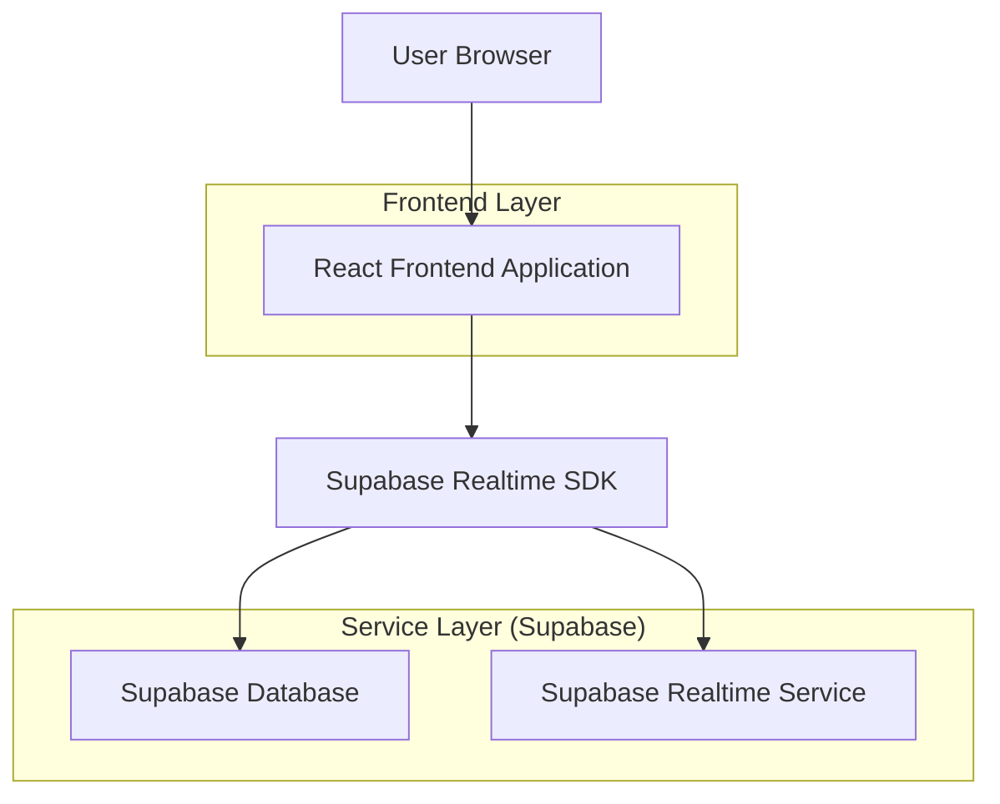
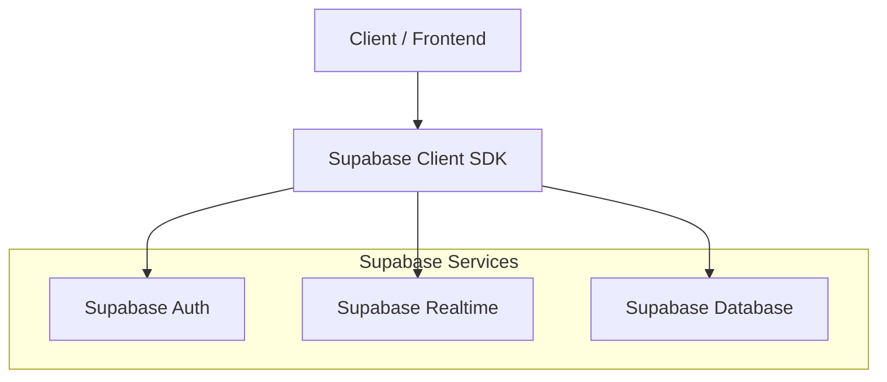
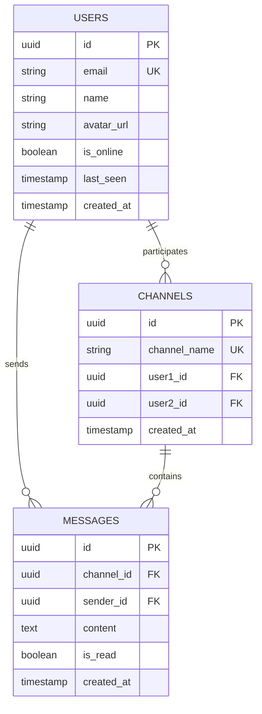

## 1. Architecture design



## 2. Technology Description

- Frontend: React@18 + tailwindcss@3 + vite
- Initialization Tool: vite-init
- Backend: Supabase (PostgreSQL + Realtime + Auth)
- Real-time Communication: Supabase Realtime subscriptions
- State Management: React Context + useState/useEffect

## 3. Route definitions

| Route | Purpose |
|-------|---------|
| / | Lista de Conversas - Dashboard principal com todas as conversas do usuário |
| /chat/:userId | Chat Individual - Tela de conversa com mensagens em tempo real |
| /search | Busca de Usuários - Encontrar e iniciar novas conversas |
| /profile | Perfil do Usuário - Configurações e informações pessoais |

## 4. API definitions

### 4.1 Core API

**Criar ou Buscar Canal Único**
```
POST /api/channels/get-or-create
```

Request:
| Param Name | Param Type | isRequired | Description |
|------------|------------|------------|-------------|
| other_user_id | string | true | ID do outro usuário |

Response:
| Param Name | Param Type | Description |
|------------|------------|-------------|
| channel_id | string | ID único do canal criado |
| created | boolean | Se o canal foi criado agora |

**Enviar Mensagem via Realtime**
```
supabase.channel(`chat:${channelId}`)
  .subscribe()
```

**Buscar Histórico de Mensagens**
```
GET /api/messages/:channelId
```

Query Params:
| Param Name | Param Type | isRequired | Description |
|------------|------------|------------|-------------|
| limit | number | false | Limite de mensagens (default: 50) |
| before | string | false | ID da mensagem para paginação |

## 5. Server architecture diagram



## 6. Data model

### 6.1 Data model definition



### 6.2 Data Definition Language

**Users Table (users)**
```sql
-- create table
CREATE TABLE users (
    id UUID PRIMARY KEY DEFAULT gen_random_uuid(),
    email VARCHAR(255) UNIQUE NOT NULL,
    name VARCHAR(100) NOT NULL,
    avatar_url TEXT,
    is_online BOOLEAN DEFAULT false,
    last_seen TIMESTAMP WITH TIME ZONE DEFAULT NOW(),
    created_at TIMESTAMP WITH TIME ZONE DEFAULT NOW()
);

-- enable RLS
ALTER TABLE users ENABLE ROW LEVEL SECURITY;

-- policies
CREATE POLICY "Users can view all users" ON users FOR SELECT USING (true);
CREATE POLICY "Users can update own profile" ON users FOR UPDATE USING (auth.uid() = id);
```

**Channels Table (channels)**
```sql
-- create table
CREATE TABLE channels (
    id UUID PRIMARY KEY DEFAULT gen_random_uuid(),
    channel_name VARCHAR(255) UNIQUE NOT NULL,
    user1_id UUID NOT NULL REFERENCES users(id),
    user2_id UUID NOT NULL REFERENCES users(id),
    created_at TIMESTAMP WITH TIME ZONE DEFAULT NOW(),
    UNIQUE(user1_id, user2_id)
);

-- create index
CREATE INDEX idx_channels_user1 ON channels(user1_id);
CREATE INDEX idx_channels_user2 ON channels(user2_id);
CREATE INDEX idx_channels_name ON channels(channel_name);

-- enable RLS
ALTER TABLE channels ENABLE ROW LEVEL SECURITY;

-- policies
CREATE POLICY "Users can view own channels" ON channels FOR SELECT USING (
    auth.uid() = user1_id OR auth.uid() = user2_id
);
```

**Messages Table (messages)**
```sql
-- create table
CREATE TABLE messages (
    id UUID PRIMARY KEY DEFAULT gen_random_uuid(),
    channel_id UUID NOT NULL REFERENCES channels(id) ON DELETE CASCADE,
    sender_id UUID NOT NULL REFERENCES users(id),
    content TEXT NOT NULL,
    is_read BOOLEAN DEFAULT false,
    created_at TIMESTAMP WITH TIME ZONE DEFAULT NOW()
);

-- create index
CREATE INDEX idx_messages_channel ON messages(channel_id);
CREATE INDEX idx_messages_sender ON messages(sender_id);
CREATE INDEX idx_messages_created ON messages(created_at DESC);

-- enable RLS
ALTER TABLE messages ENABLE ROW LEVEL SECURITY;

-- policies
CREATE POLICY "Users can view messages from own channels" ON messages FOR SELECT USING (
    EXISTS (
        SELECT 1 FROM channels 
        WHERE channels.id = messages.channel_id 
        AND (channels.user1_id = auth.uid() OR channels.user2_id = auth.uid())
    )
);

CREATE POLICY "Users can send messages to channels they participate" ON messages FOR INSERT 
WITH CHECK (
    sender_id = auth.uid() AND
    EXISTS (
        SELECT 1 FROM channels 
        WHERE channels.id = channel_id 
        AND (channels.user1_id = auth.uid() OR channels.user2_id = auth.uid())
    )
);
```

## 7. Realtime Configuration

**Habilitar Realtime para tabelas**
```sql
-- habilitar realtime para channels
ALTER PUBLICATION supabase_realtime ADD TABLE channels;

-- habilitar realtime para messages
ALTER PUBLICATION supabase_realtime ADD TABLE messages;
```

**Função para gerar nome único do canal**
```sql
CREATE OR REPLACE FUNCTION generate_channel_name(user1 UUID, user2 UUID)
RETURNS TEXT AS $$
BEGIN
    RETURN CASE 
        WHEN user1 < user2 THEN user1::text || '_' || user2::text
        ELSE user2::text || '_' || user1::text
    END;
END;
$$ LANGUAGE plpgsql;
```

**Trigger para auto-gerar channel_name**
```sql
CREATE OR REPLACE FUNCTION set_channel_name()
RETURNS TRIGGER AS $$
BEGIN
    NEW.channel_name := generate_channel_name(NEW.user1_id, NEW.user2_id);
    RETURN NEW;
END;
$$ LANGUAGE plpgsql;

CREATE TRIGGER trigger_set_channel_name
    BEFORE INSERT ON channels
    FOR EACH ROW
    EXECUTE FUNCTION set_channel_name();
```