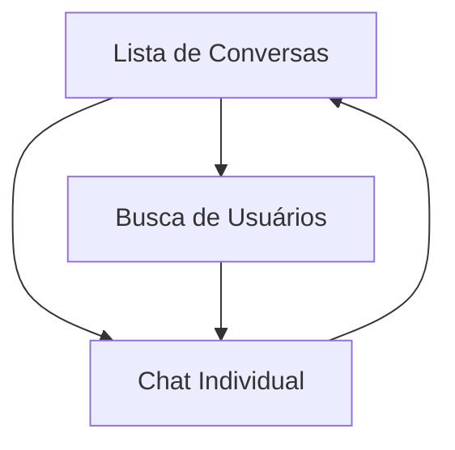

## 1. Product Overview
Sistema de chat privado 1:1 que permite comunicação instantânea entre usuários sem necessidade de convites. Cada par de usuários tem um canal único exclusivo, com mensagens em tempo real e histórico persistente.

O produto resolve a necessidade de comunicação direta e privada entre usuários, ideal para redes sociais, marketplaces ou plataformas de networking onde usuários precisam conversar sem barreiras de convites.

## 2. Core Features

### 2.1 User Roles
| Role | Registration Method | Core Permissions |
|------|---------------------|------------------|
| Usuário Comum | Email ou rede social | Criar chats, enviar/receber mensagens, ver histórico |
| Usuário Premium | Upgrade via pagamento | Sem limitações de histórico, confirmação de leitura |

### 2.2 Feature Module
Nosso sistema de chat consiste nas seguintes páginas principais:
1. **Lista de Conversas**: Mostra todos os chats ativos do usuário com preview da última mensagem e indicador de mensagens não lidas.
2. **Chat Individual**: Tela de conversa propriamente dita com campo de mensagem, histórico scrollable e informações do outro usuário.
3. **Busca de Usuários**: Permite encontrar e iniciar conversa com qualquer usuário da plataforma.

### 2.3 Page Details
| Page Name | Module Name | Feature description |
|-----------|-------------|---------------------|
| Lista de Conversas | Lista de chats | Exibir chats ordenados por última mensagem, mostrar foto e nome do outro usuário, indicador de mensagens não lidas, preview de 2 linhas da última mensagem |
| Lista de Conversas | Busca rápida | Filtrar conversas por nome do usuário com busca em tempo real |
| Chat Individual | Área de mensagens | Exibir histórico de mensagens com scroll infinito, diferenciar mensagens enviadas/recebidas por cores e posicionamento, mostrar horário das mensagens |
| Chat Individual | Input de mensagem | Campo de texto multilinha, botão de envio, suporte a emoji, indicador de "digitando..." em tempo real |
| Chat Individual | Header do chat | Foto e nome do outro usuário, status online/offline, botão de voltar |
| Busca de Usuários | Lista de usuários | Exibir todos os usuários disponíveis, foto, nome e status online, botão "Iniciar conversa" que cria canal único |
| Busca de Usuários | Campo de busca | Busca por nome com autocomplete, filtros por status online |

## 3. Core Process
**Fluxo de Início de Conversa:**
Usuário acessa a busca → Digite nome do usuário desejado → Clique no usuário → Sistema verifica se canal existe → Se não existe, cria canal único baseado em IDs ordenados → Redireciona para chat → Mensagens são enviadas/recebidas em tempo real via WebSocket.

**Fluxo de Continuação de Conversa:**
Usuário acessa lista de conversas → Visualiza previews e indicadores de não-lidas → Clique na conversa desejada → Carrega histórico de mensagens → Usuário envia/recebe mensagens → Mensagens são marcadas como lidas quando visualizadas.

## 4. User Interface Design

### 4.1 Design Style
- **Cores primárias**: Azul moderno (#2563EB) para mensagens do usuário, cinza claro (#F3F4F6) para mensagens recebidas
- **Cores secundárias**: Verde (#10B981) para status online, vermelho (#EF4444) para indicadores de não-lidas
- **Botões**: Estilo arredondado com sombras sutis, hover effects suaves
- **Fontes**: Inter ou Roboto, tamanhos 14px para mensagens, 16px para headers
- **Layout**: Card-based com bordas arredondadas, design limpo e minimalista
- **Ícones**: Estilo outline consistente, uso de emojis nativos do sistema

### 4.2 Page Design Overview
| Page Name | Module Name | UI Elements |
|-----------|-------------|-------------|
| Lista de Conversas | Lista de chats | Cards horizontais com avatar circular 48px, nome em negrito 16px, preview 14px cinza, badge vermelho circular para não-lidas, separadores sutis entre items |
| Chat Individual | Área de mensagens | Container com altura dinâmica, mensagens em bubbles arredondados, máximo 70% da largura, cores diferentes para enviadas/recebidas, timestamp 12px cinza claro |
| Chat Individual | Input de mensagem | Barra fixa na parte inferior, textarea auto-expansível, botão enviar circular com ícone de avião, altura mínima 56px, borda superior suave |
| Busca de Usuários | Cards de usuário | Grid responsivo de cards, avatar 64px, nome 18px, status online com bolinha verde, botão primário arredondado |

### 4.3 Responsiveness
Desktop-first com adaptação mobile completa. Em mobile: lista de conversas ocupa 100% da largura, chat individual em tela cheia com header fixo, input adaptável ao teclado virtual. Touch otimizado com áreas de clique mínimas de 44px.

### 4.4 Animações e Transições
Transições suaves de 200ms para navegação entre páginas, animação de "digitando..." com 3 pontos pulsando, scroll suave ao carregar mensagens antigas, indicador de nova mensagem com animação de slide.