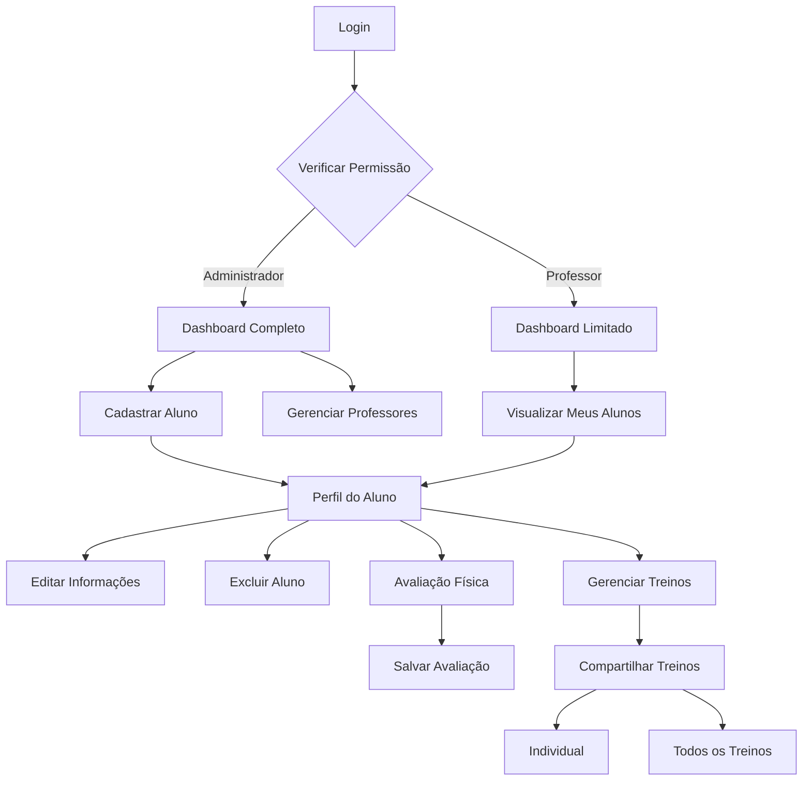

## 1. Visão Geral do Produto
Sistema CMD/ALUNOS para gestão de alunos, avaliações físicas e treinos com controle de acesso por professores.
Permite cadastro, edição, exclusão de alunos, avaliações físicas completas e compartilhamento de treinos.

## 2. Funcionalidades Principais

### 2.1 Papéis de Usuário
| Papel | Método de Acesso | Permissões Principais |
|------|-------------------|---------------------|
| Administrador | Login master | Acesso completo - cadastrar/editar/excluir alunos e professores |
| Professor | Login credenciado | Acesso limitado - cadastrar/editar/excluir alunos, sem acesso ao cadastro de professores |

### 2.2 Módulos de Funcionalidades
Nosso CMD/ALUNOS consiste nas seguintes páginas principais:
1. **Dashboard Principal**: visão geral dos alunos, estatísticas e navegação rápida.
2. **Cadastro de Alunos**: formulário completo para novo aluno com dados pessoais e objetivos.
3. **Perfil do Aluno**: visualização e edição completa de informações, avaliação física e treinos.
4. **Avaliação Física**: formulário detalhado com medidas corporais, composição, testes físicos.
5. **Gerenciamento de Treinos**: criação e visualização de treinos (A, B, C, etc.).
6. **Compartilhamento de Treinos**: exportação individual ou completa de treinos.
7. **Gerenciamento de Professores**: cadastro e controle de acesso dos coaches.

### 2.3 Detalhamento das Páginas
| Nome da Página | Módulo | Descrição da Funcionalidade |
|----------------|---------|---------------------------|
| Dashboard Principal | Lista de Alunos | Visualizar todos os alunos cadastrados com busca e filtros rápidos |
| Dashboard Principal | Estatísticas | Mostrar total de alunos, avaliações realizadas, treinos ativos |
| Dashboard Principal | Ações Rápidas | Acesso direto ao cadastro de novo aluno e últimas avaliações |
| Cadastro de Alunos | Formulário Principal | Campos: nome, email, telefone, data nascimento, objetivo, observações |
| Cadastro de Alunos | Endereço | Campos: rua, número, bairro, cidade, estado, CEP |
| Cadastro de Alunos | Saúde | Campos: restrições médicas, lesões, medicamentos em uso |
| Perfil do Aluno | Informações Pessoais | Visualizar e editar todos os dados cadastrais do aluno |
| Perfil do Aluno | Botão Editar | Habilitar modo de edição para todas as informações do aluno |
| Perfil do Aluno | Botão Excluir | Remover aluno com confirmação e limpeza completa no Supabase |
| Perfil do Aluno | Histórico de Avaliações | Timeline com todas as avaliações físicas realizadas |
| Perfil do Aluno | Treinos Atuais | Visualizar treinos A, B, C com exercícios, séries e repetições |
| Avaliação Física | Medidas Corporais | Campos: peso, altura, circunferências (braço, peito, cintura, quadril, coxa) |
| Avaliação Física | Composição Corporal | Campos: percentual gordura, massa magra, índice massa corporal |
| Avaliação Física | Testes Físicos | Campos: resistência, flexibilidade, força, frequência cardíaca de repouso |
| Avaliação Física | Fotos de Evolução | Upload de fotos frontal, lateral e posterior do aluno |
| Gerenciamento de Treinos | Lista de Treinos | Visualizar treinos A, B, C, D com status ativo/inativo |
| Gerenciamento de Treinos | Criação de Treino | Adicionar exercícios com séries, repetições, cargas e descanso |
| Gerenciamento de Treinos | Edição de Exercícios | Modificar exercícios existentes com drag and drop para reordenar |
| Compartilhamento de Treinos | Exportar Individual | Gerar PDF ou link compartilhável de um treino específico (ex: apenas Treino A) |
| Compartilhamento de Treinos | Exportar Todos | Gerar PDF ou link com todos os treinos do aluno (A, B, C, etc.) |
| Compartilhamento de Treinos | QR Code | Gerar código QR para acesso rápido aos treinos no celular |
| Gerenciamento de Professores | Lista de Professores | Visualizar todos os coaches cadastrados com status ativo/inativo |
| Gerenciamento de Professores | Cadastro Professor | Campos: nome, email, telefone, especialização, registro CREF |
| Gerenciamento de Professores | Permissões | Definir quais funcionalidades o professor pode acessar |
| Gerenciamento de Professores | Restrição de Acesso | Professor não pode cadastrar outros professores (apenas administrador) |

## 3. Fluxo Principal do Sistema
Administrador acessa o sistema com login master, visualiza dashboard com todos os alunos. Pode cadastrar novo aluno com informações completas, realizar avaliação física detalhada e criar treinos personalizados. Professor acessa com credenciais limitadas, visualiza apenas seus alunos, pode editar informações, realizar avaliações, mas não acessa área de gerenciamento de professores.

## 4. Design da Interface

### 4.1 Estilo Visual
- Cores principais: azul profissional (#1e40af) e branco (#ffffff)
- Cores secundárias: cinza claro (#f3f4f6) e verde sucesso (#10b981)
- Estilo de botões: arredondados com sombra sutil, hover com transição suave
- Tipografia: fonte sans-serif moderna (Inter ou Roboto), títulos 24px, texto 16px
- Layout: cards organizados com grid responsivo, navegação lateral fixa
- Ícones: estilo outline minimalista, consistentes em todo o sistema

### 4.2 Elementos por Página
| Nome da Página | Módulo | Elementos de UI |
|----------------|---------|-----------------|
| Dashboard Principal | Cards de Estatísticas | Cards coloridos com ícones grandes, números destacados em negrito |
| Dashboard Principal | Tabela de Alunos | Tabela zebra com hover, botões de ação compactos, barra de busca superior |
| Perfil do Aluno | Header | Foto do aluno circular, nome em fonte 24px, botões de ação alinhados à direita |
| Perfil do Aluno | Formulário de Edição | Campos com bordas arredondadas, labels em cinza, validação em tempo real |
| Avaliação Física | Formulário | Grupos de campos organizados por categorias, inputs numéricos com step arrows |
| Gerenciamento de Treinos | Lista de Exercícios | Cards arrastáveis, badge de série/repetição, botão de deletar em vermelho |
| Compartilhamento | Modal de Exportação | Opções de PDF/link/QR code, preview antes de gerar, botão de copiar link |

### 4.3 Responsividade
Design desktop-first com adaptação para tablets e smartphones. Menu lateral vira hambúrguer no mobile, tabelas viram cards empilhados, formulários em coluna única. Touch otimizado com botões maiores em telas pequenas.

### 4.4 Interações e Feedback
- Loading states em todos os botões de ação
- Confirmações modais para exclusão de dados
- Toast notifications para sucesso/erro
- Auto-save em formulários longos
- Preview em tempo real de PDFs