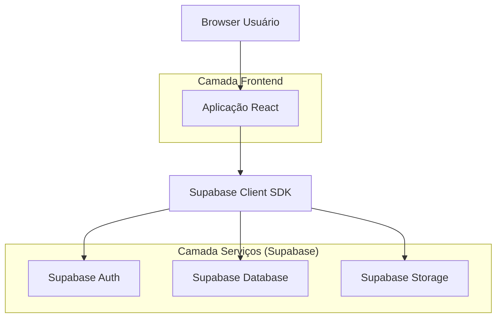
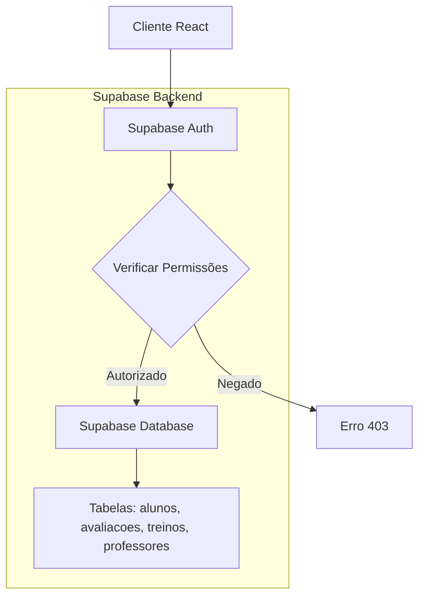
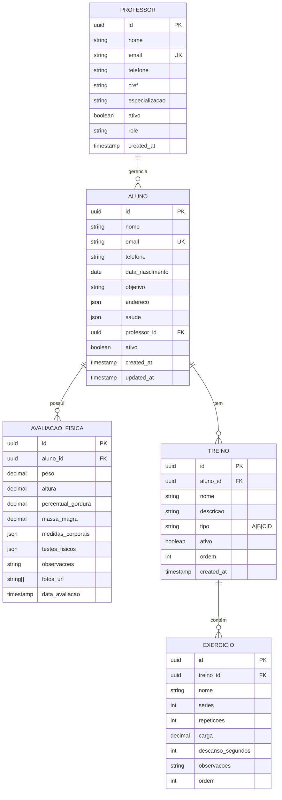

## 1. Arquitetura do Sistema



## 2. Tecnologias Utilizadas

- Frontend: React@18 + TypeScript + TailwindCSS@3 + Vite
- Ferramenta de Inicialização: vite-init
- Backend: Supabase (BaaS)
- Bibliotecas Adicionais: 
  - @supabase/supabase-js (cliente Supabase)
  - react-hook-form (gerenciamento de formulários)
  - lucide-react (ícones)
  - html2pdf.js (geração de PDFs)
  - qrcode.react (geração de QR codes)

## 3. Definições de Rotas

| Rota | Propósito |
|------|-----------|
| /login | Página de autenticação, login de administradores e professores |
| /dashboard | Dashboard principal com visão geral dos alunos |
| /alunos/novo | Formulário de cadastro de novo aluno |
| /alunos/:id | Perfil completo do aluno com informações, avaliações e treinos |
| /alunos/:id/editar | Formulário de edição de dados do aluno |
| /alunos/:id/avaliacao | Formulário de avaliação física completa |
| /alunos/:id/treinos | Gerenciamento de treinos do aluno |
| /alunos/:id/treinos/compartilhar | Interface de compartilhamento de treinos |
| /professores | Lista e gerenciamento de professores (apenas administrador) |
| /professores/novo | Cadastro de novo professor (apenas administrador) |
| /configuracoes | Configurações do sistema e permissões |

## 4. Definições de APIs

### 4.1 APIs de Autenticação

```
POST /auth/v1/token
```

Request:
```json
{
  "email": "admin@cmd.com",
  "password": "senha123"
}
```

Response:
```json
{
  "access_token": "eyJhbGc...",
  "token_type": "bearer",
  "expires_in": 3600,
  "user": {
    "id": "uuid",
    "email": "admin@cmd.com",
    "role": "administrador"
  }
}
```

### 4.2 APIs de Dados (via Supabase)

**Listar Alunos**
```
GET /rest/v1/alunos?select=*
```

**Criar Aluno**
```
POST /rest/v1/alunos
```

Request:
```json
{
  "nome": "João Silva",
  "email": "joao@email.com",
  "telefone": "(11) 99999-9999",
  "data_nascimento": "1990-01-15",
  "objetivo": "Hipertrofia",
  "endereco": {
    "rua": "Rua Principal",
    "numero": "123",
    "bairro": "Centro",
    "cidade": "São Paulo",
    "estado": "SP",
    "cep": "01000-000"
  }
}
```

**Excluir Aluno (com cascade)**
```
DELETE /rest/v1/alunos?id=eq.{id}
```

## 5. Arquitetura do Servidor



## 6. Modelo de Dados

### 6.1 Diagrama ER



### 6.2 Definições DDL

**Tabela Professores**
```sql
CREATE TABLE professores (
  id UUID PRIMARY KEY DEFAULT gen_random_uuid(),
  nome VARCHAR(100) NOT NULL,
  email VARCHAR(255) UNIQUE NOT NULL,
  telefone VARCHAR(20),
  cref VARCHAR(20),
  especializacao VARCHAR(100),
  ativo BOOLEAN DEFAULT true,
  role VARCHAR(20) DEFAULT 'professor' CHECK (role IN ('administrador', 'professor')),
  created_at TIMESTAMP WITH TIME ZONE DEFAULT NOW()
);

-- Permissões
GRANT SELECT ON professores TO anon;
GRANT ALL PRIVILEGES ON professores TO authenticated;
```

**Tabela Alunos**
```sql
CREATE TABLE alunos (
  id UUID PRIMARY KEY DEFAULT gen_random_uuid(),
  nome VARCHAR(100) NOT NULL,
  email VARCHAR(255) UNIQUE,
  telefone VARCHAR(20),
  data_nascimento DATE,
  objetivo VARCHAR(200),
  endereco JSONB,
  saude JSONB,
  professor_id UUID REFERENCES professores(id) ON DELETE CASCADE,
  ativo BOOLEAN DEFAULT true,
  created_at TIMESTAMP WITH TIME ZONE DEFAULT NOW(),
  updated_at TIMESTAMP WITH TIME ZONE DEFAULT NOW()
);

-- Índices para performance
CREATE INDEX idx_alunos_professor_id ON alunos(professor_id);
CREATE INDEX idx_alunos_ativo ON alunos(ativo);

-- Permissões
GRANT SELECT ON alunos TO anon;
GRANT ALL PRIVILEGES ON alunos TO authenticated;
```

**Tabela Avaliações Físicas**
```sql
CREATE TABLE avaliacoes_fisicas (
  id UUID PRIMARY KEY DEFAULT gen_random_uuid(),
  aluno_id UUID NOT NULL REFERENCES alunos(id) ON DELETE CASCADE,
  peso DECIMAL(5,2),
  altura DECIMAL(5,2),
  percentual_gordura DECIMAL(5,2),
  massa_magra DECIMAL(5,2),
  medidas_corporais JSONB,
  testes_fisicos JSONB,
  observacoes TEXT,
  fotos_url TEXT[],
  data_avaliacao TIMESTAMP WITH TIME ZONE DEFAULT NOW()
);

-- Índices
CREATE INDEX idx_avaliacoes_aluno_id ON avaliacoes_fisicas(aluno_id);
CREATE INDEX idx_avaliacoes_data ON avaliacoes_fisicas(data_avaliacao DESC);

-- Permissões
GRANT SELECT ON avaliacoes_fisicas TO anon;
GRANT ALL PRIVILEGES ON avaliacoes_fisicas TO authenticated;
```

**Tabela Treinos**
```sql
CREATE TABLE treinos (
  id UUID PRIMARY KEY DEFAULT gen_random_uuid(),
  aluno_id UUID NOT NULL REFERENCES alunos(id) ON DELETE CASCADE,
  nome VARCHAR(100) NOT NULL,
  descricao TEXT,
  tipo VARCHAR(1) CHECK (tipo IN ('A', 'B', 'C', 'D', 'E')),
  ativo BOOLEAN DEFAULT true,
  ordem INTEGER DEFAULT 1,
  created_at TIMESTAMP WITH TIME ZONE DEFAULT NOW()
);

CREATE INDEX idx_treinos_aluno_id ON treinos(aluno_id);
CREATE INDEX idx_treinos_tipo ON treinos(tipo);

GRANT SELECT ON treinos TO anon;
GRANT ALL PRIVILEGES ON treinos TO authenticated;
```

**Tabela Exercícios**
```sql
CREATE TABLE exercicios (
  id UUID PRIMARY KEY DEFAULT gen_random_uuid(),
  treino_id UUID NOT NULL REFERENCES treinos(id) ON DELETE CASCADE,
  nome VARCHAR(100) NOT NULL,
  series INTEGER NOT NULL,
  repeticoes INTEGER NOT NULL,
  carga DECIMAL(5,2),
  descanso_segundos INTEGER,
  observacoes TEXT,
  ordem INTEGER NOT NULL
);

CREATE INDEX idx_exercicios_treino_id ON exercicios(treino_id);

GRANT SELECT ON exercicios TO anon;
GRANT ALL PRIVILEGES ON exercicios TO authenticated;
```

## 7. Regras de Negócio

### 7.1 Controle de Acesso
- Administradores podem cadastrar/editar/excluir professores e alunos
- Professores só podem gerenciar seus próprios alunos
- Professores não podem acessar área de gerenciamento de professores
- Soft delete implementado (campo `ativo` = false ao invés de deletar)

### 7.2 Exclusão de Alunos
Quando um aluno é excluído:
1. Todas as avaliações físicas são deletadas (CASCADE)
2. Todos os treinos e exercícios são deletados (CASCADE)
3. Fotos da avaliação são removidas do Supabase Storage
4. Registro do aluno é removido permanentemente

### 7.3 Compartilhamento de Treinos
- Links gerados expiram em 7 dias por padrão
- PDFs incluem logo da academia e informações do aluno
- QR codes direcionam para página mobile otimizada
- Acesso sem autenticação para facilitar compartilhamento